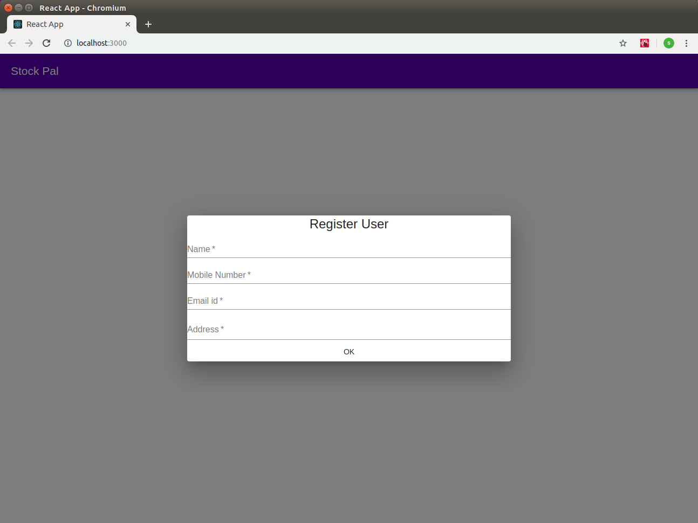
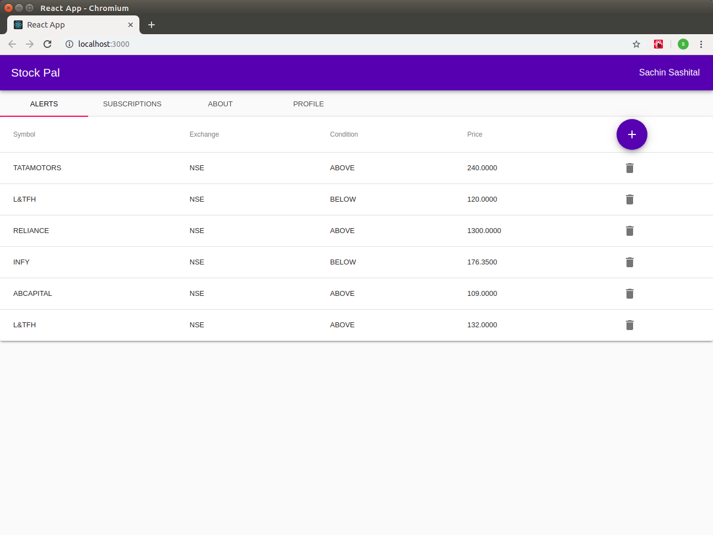
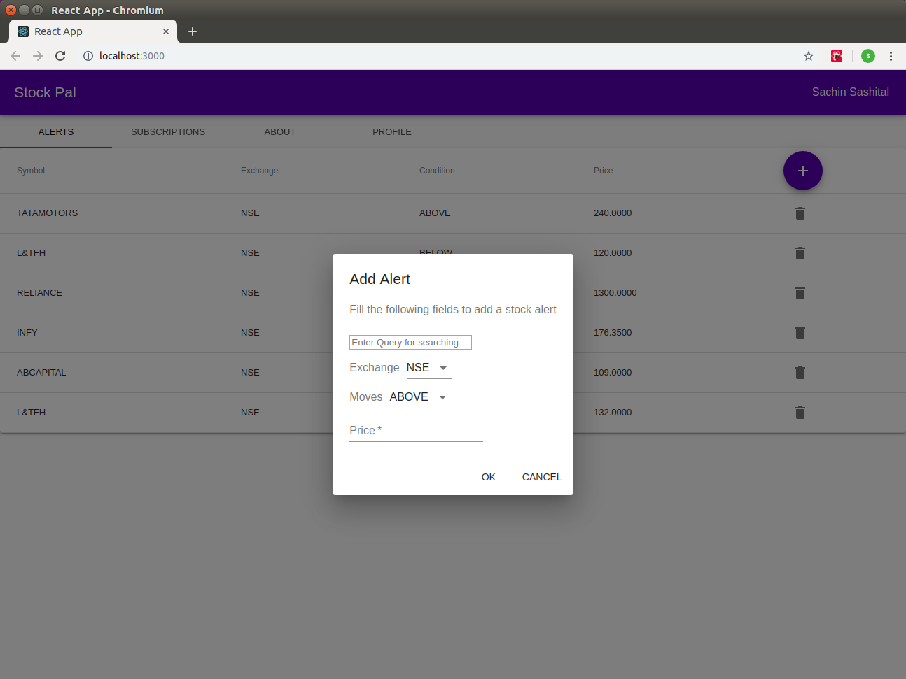
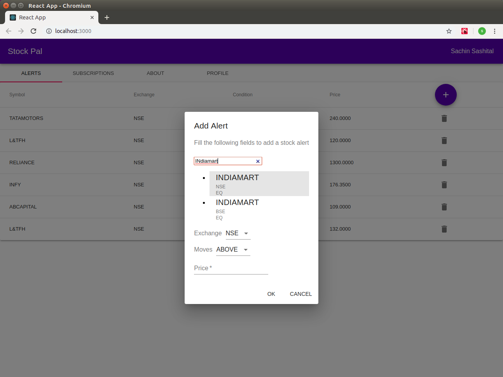
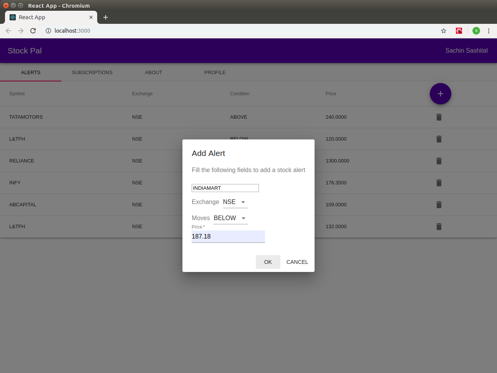
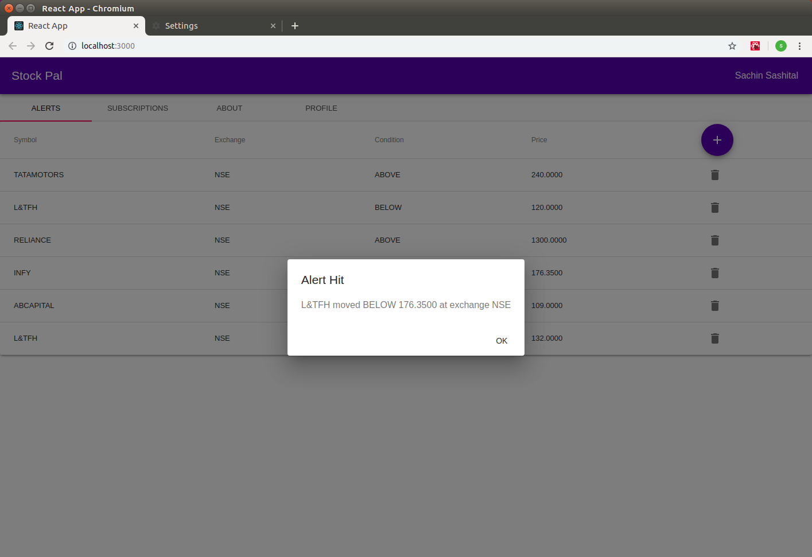

# react_stock_alert_app
Minimalist React and Material-UI PWA (Progressive Web App) for setting Stock alerts and getting alert  notifications

## Overview
As the description above says, this uses a minimal set of features and ideas of React app programming alongwith the React Material UI module, in order to create a Web app for setting, displaying and deleting stock alerts, and alerting the user with Browser notification when the alert condition is met. Currently, the app supports only Stock price based alerts. The back end server code for this app is not included in this codebase. The app is configured to use a service worker which is connected to a messaging server based on the MQTT protocol. Again, the MQTT server code is not part of this codebase. When the user sets an alert, the service worker subscribes to the relevant topic corresponding to this alert with the MQTT server. When the stock price condition mentioned in the alert is met, the server publishes a message to the alert topic in the MQTT server (this is in the back end and not part of this codebase), and the subscribed service worker on this web client receives that message, in response to which it requests the browser to show a notification about the alert.

## Typical User workflow
* The first time a user visits the web app url,she will see a login dialog as follows:

* Once the user is done with logging in, she will see the following dashboard with a list (empty first time) of stock alerts already set by the user

The '+' icon button in the above dashboard enables creation of a new stock alert. Every alert row in the listing has a delete icon (dustbin icon) which when clicked deletes the alert. The following dialog appears when the create icon button is clicked

In this create alert dialog, the first input field is for adding the stock symbol name. This field supports auto suggestion. When the user types more than 3 letters, the auto suggestion kicks in and she is shown a list of possible symbols to choose from.

Once the user is done filling the information, clicking ok creates a new alert

Later in time, if and when this alert condition is hit on the server, the latter communicates this event to the client side via the MQTT server mentioned earlier. This communication message is received by the service worker, which then requests the browser to notify the user via a notification dialog as follows:

## Implementation notes
This project was created by using the standard create-react-app command, after installing react. Thus (applies to Ubuntu Linux):

`sudo npm install -g create-react-app

create-react-app github_react_stock_alert_app`

This command creates all the skeleton files required for the react web app project, including the public/index.html, the public/index.js file and the src/App.js
The App.js file is usually where we start coding the UI and so is the case here. But before that, one point to note is that in order to make this a progressive web app, we need to make some changes to the index.js file to register a service worker as outlined in these web pages:

https://developers.google.com/web/fundamentals/primers/service-workers/

https://facebook.github.io/create-react-app/docs/making-a-progressive-web-app

Although currently I do not use the page caching function of the service worker, this is a useful 'todo' especially for storing the symbols list in service worker cache. The service worker is mainly used here for communication with the MQTT server. It also uses the swchannel.js file which creates a BroadcastChannel object for the service worker to post messages to the browser, using the postMessage API of the BroadcastChannel object. Currently a message is posted to the web browser when the service worker  receives an MQTT message about a stock alert condition having been met. For this, the service worker also initiates a connection with the MQTT server and specifies a handler to handle these messages received from the latter. The relevant files to look at on the service worker side are src/serviceworker.js, src/swchannel.js and src/moscaclient.js.

Returning to the UI code, the App react component defined in the src/App.js file either inserts the Home component or the RegisterUser react dialog component into the virtual DOM, depending on whether the user is already registered or not from this browser. All components make use of a common store created (in the src/components/ProviderContext.js file) via the react-redux module and a common react context object.
The Home component uses the material-ui Tabs component to show  as tab contents the, list of alerts set by the user, her subscriptions etc.. Currently only the 'Alerts' tab showing the list of alerts is implemented. This is the same as the alerts dashboard mentioned earlier.
For the auto-suggest feature of the Create Alert dialog symbol name input, the react-autosuggest module is used as in the src/components/PaginatedAutoSuggest.jsx file.
The src/broadcastchannel.js file contains code for creating a BroadcastChannel object on the web browser side, in order to send and receive messages to or from the service worker. Currently the web browser sends a message when the user creates a new stock alert (see src/components/AddStockAlertDialog.jsx) and receives a message when the service worker sends a message about an alert condition having been met (see src/broadcastchannel.js).
